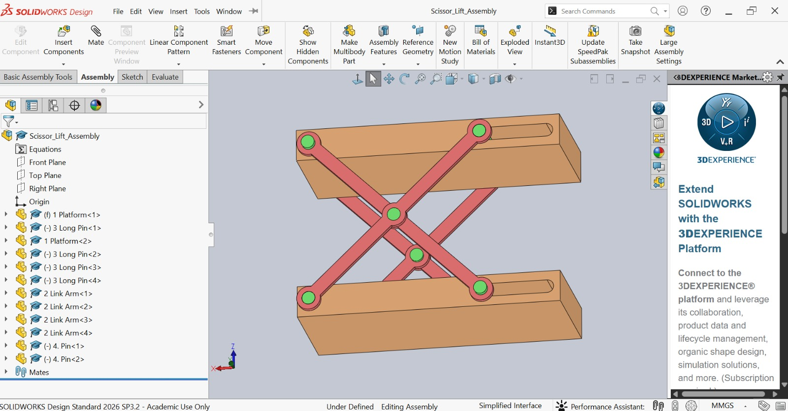

# Scissor Lift Mechanism — SOLIDWORKS

A 3D mechanical assembly of a **scissor lift mechanism** designed and assembled using **SOLIDWORKS**.

## Project Overview

The mechanism consists of interconnected link arms, pivot pins, platforms, and sliding slots to produce controlled vertical lifting motion.

## Components

- Upper Platform
- Lower Platform
- Link Arms
- Long Pins
- Pivot Pins
- Sliding Slots

## SOLIDWORKS Mates Used

- Concentric Mate
- Coincident Mate
- Width Mate
- Slot Mate
- Distance Mate
- Limit Distance Mate

These mates were used to accurately position components, maintain alignment, and control the movement of the mechanism.

## Files

| Component | File |
|---|---|
| Platform | `1 Platform.SLDPRT` |
| Link Arm | `2 Link Arm.SLDPRT` |
| Long Pin | `3 Long Pin.SLDPRT` |
| Pin | `4 Pin.SLDPRT` |
| Complete Assembly | `Scissor_Lift_Assembly.SLDASM` |

## Mechanism

The link arms rotate around their pivot joints while the platform pins slide through the slots, allowing the upper platform to move vertically.

## Software

**SOLIDWORKS**

## Key Skills

- 3D Mechanical Modeling
- Assembly Design
- Mechanical Linkages
- Assembly Mates & Constraints
- Motion Control
- Component Alignment
